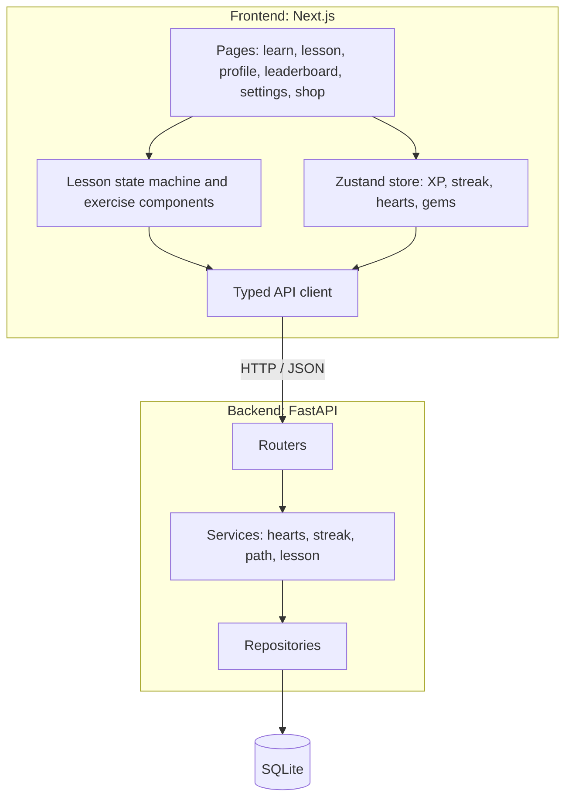

# Duolingo Web App Clone

A fullstack clone of the Duolingo web app with a skill path, a lesson player with five exercise types, XP, streaks, hearts, a daily goal, a leaderboard and a profile page.

- **Live demo:** https://duolingo-clone-two-vert.vercel.app
- **Source code:** https://github.com/guhya-16/duolingo-clone

> The backend runs on a free hosting tier. After idle time the first request can take up to a minute while it wakes up.

---

## Tech stack

| Layer | Technology |
| --- | --- |
| Frontend | Next.js 14 (App Router), React 18, TypeScript, Tailwind CSS, Zustand |
| Backend | Python 3.11+, FastAPI, SQLAlchemy 2.0, Pydantic v2 |
| Database | SQLite |
| Testing | Pytest |
| Hosting | Vercel (frontend), Render (backend) |

---

## Setup instructions

**Requirements:** Python 3.11+ and Node.js 18+

### Backend

```bash
cd backend
python -m venv venv

# Windows
venv\Scripts\activate
# macOS / Linux
source venv/bin/activate

pip install -r requirements.txt
python -m app.seed --reset
uvicorn app.main:app --reload --port 8000
```

The API runs at http://localhost:8000 and its interactive docs are at http://localhost:8000/docs. Run the tests with `pytest -v` inside `backend/`.

### Frontend

```bash
cd frontend
npm install
echo "NEXT_PUBLIC_API_URL=http://localhost:8000" > .env.local
npm run dev
```

The app runs at http://localhost:3000.

### Deployment settings

- Frontend (Vercel): set `NEXT_PUBLIC_API_URL` to the backend URL, with no trailing slash, and redeploy.
- Backend (Render): set `CORS_ORIGINS` to include the frontend URL.

---

## Architecture overview



The backend is layered as routers, services, repositories and database. Routers handle HTTP only, services contain the game rules (hearts, streak, XP, skill unlocking), and repositories contain the database queries. All dates come from one clock helper, so streak and hearts logic can be tested by sending an `X-Debug-Date` header.

The frontend uses the Next.js App Router. A Zustand store holds the learner's stats, and the lesson player is a reducer-based state machine with one component per exercise type.

---

## Database schema


**Notes**

- Course content is a hierarchy: Course, Unit, Skill, Lesson, Exercise. Deleting a course cascades to everything below it.
- Each exercise type has a different shape (options, word bank, pairs), so exercises share one table with a `type` column and a JSON `payload`.
- `user_skill_progress` has one row per user and skill (unique on `user_id, skill_id`) and stores the highest level completed.
- `xp_events` is an audit trail. Its `lesson_id` is set to NULL if the lesson is deleted, so XP history is kept.
- `daily_activity` stores XP per user per day (unique on `user_id, activity_date`) and drives the daily goal.
- Foreign keys are enforced on every SQLite connection.

**Seed data:** one Spanish course with 2 units, 6 skills, 12 lessons and 96 exercises covering all five types, a default learner with some progress, 10 other users for the leaderboard, and 8 achievements.

---

## API overview

| Method | Endpoint | Description |
| --- | --- | --- |
| GET | `/course/path` | Units and skills with locked, available or completed state and progress |
| GET | `/lessons/{id}` | Lesson exercises with solutions removed |
| POST | `/lessons/{id}/answer` | Check one answer; a wrong answer costs a heart |
| POST | `/lessons/{id}/complete` | Finish a lesson: award XP, update streak, skill progress and achievements in one transaction |
| GET | `/me` | Learner profile and live stats |
| PATCH | `/me` | Update settings such as `daily_goal_xp` |
| GET | `/me/hearts` | Current hearts and seconds until the next one |
| POST | `/me/hearts/refill` | Refill hearts for 100 gems |
| GET | `/me/achievements` | Achievements with unlocked state |
| GET | `/leaderboard` | Users ranked by total XP |
| POST | `/dev/reset` | Reseed the database (demo use) |
| GET | `/health` | Health check |

**Answer body for `POST /lessons/{id}/answer`:** `{"exercise_id": <int>, "answer": <value>}`

| Exercise type | `answer` value |
| --- | --- |
| `multiple_choice` | Selected option index, for example `0` |
| `translate_word_bank` | Ordered list of words, for example `["la", "niña", "bebe", "agua"]` |
| `match_pairs` | List of pairs, for example `[{"left": "boy", "right": "niño"}]` |
| `fill_blank` | Chosen option, for example `"come"` |
| `type_answer` | Typed text, for example `"la mujer"` |

**Error codes:** `403 out_of_hearts` (no hearts left), `403 skill_locked` (skill not unlocked yet), `403 level_locked` (previous level not completed).

---

## Assumptions

- There is no real authentication. A single default learner is always logged in, as the assignment allows. Everyone using the hosted demo shares that learner.
- Hearts are capped at 5 and regenerate by 1 every 4 hours. Regeneration is calculated when the user is fetched, so no background job is needed. Refilling costs 100 gems, and gems are mocked.
- A lesson gives 10 XP, plus 5 XP for a perfect lesson. A skill unlocks when the previous skill has at least level 1 completed.
- The streak goes up by 1 on the first lesson of each day, stays the same for more lessons that day, and resets to 1 after a missed day. The `X-Debug-Date` header, set from the Debug panel in the app, simulates other dates for testing.
- Answers are checked on the server, and solutions are never sent to the client in advance.
- The number of mistakes in a lesson is reported by the client, so the server limits it to the range 0 to the number of exercises.
- The hosted demo uses free-tier hosting with temporary storage, so demo data can reset after a redeploy or long idle period.
- Super subscription, friends and speech exercises are shown as "Coming soon" placeholders. Only one language (Spanish) is seeded, and audio is not implemented.
- The mascot and icons were created for this project and do not use Duolingo's image assets.