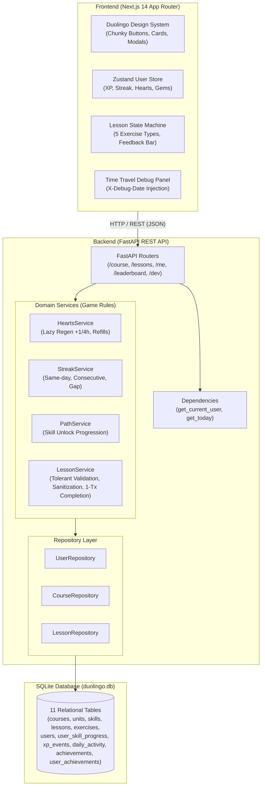
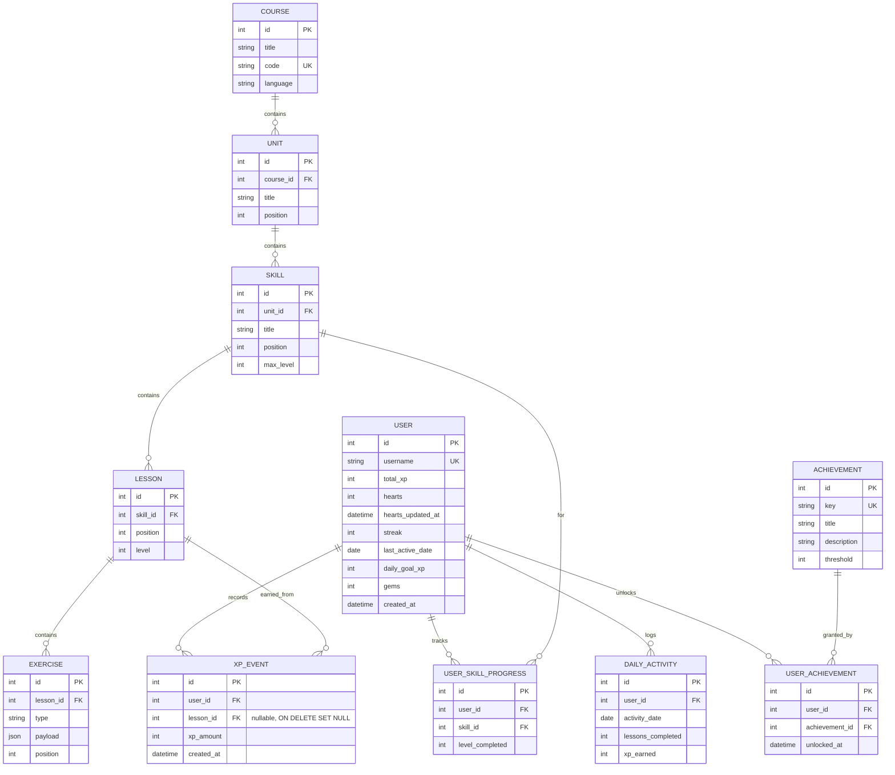

# 🦉 Duolingo Web App Clone

A fullstack **Duolingo Clone** built with **Next.js 14 (App Router, TypeScript, Tailwind CSS)** and **FastAPI (Python, SQLAlchemy 2.0, SQLite)**. Designed with authentic Duolingo UI aesthetics—featuring custom color palettes, tactile 3D bottom-shadow buttons with depress animations, sine-wave learning paths, progress rings, popover cards, and a robust interactive lesson player supporting 5 distinct exercise types.

---

## 🚀 Tech Stack

### **Frontend**
- **Framework**: Next.js 14 (App Router) + React 18 + TypeScript
- **Styling**: Tailwind CSS with custom Duolingo color palette (`#58CC02` Feather Green, `#1CB0F6` Sky Blue, `#FF4B4B` Cardinal Red, `#FFC800` Gold) & Google Fonts Nunito
- **State Management**: Zustand
- **Animations & Effects**: `canvas-confetti`, CSS 3D active translation, micro-interactions, Lucide Icons

### **Backend**
- **Framework**: FastAPI (Python 3.11+)
- **ORM & Database**: SQLAlchemy 2.0 (typed `Mapped[...]` annotations) + SQLite with strict Foreign Key enforcement (`PRAGMA foreign_keys=ON`)
- **Data Validation**: Pydantic v2
- **Testing**: Pytest with in-memory SQLite (`StaticPool`)
- **Architecture**: Strict layering: `Routers -> Services -> Repositories -> Database`

---

## 🏛️ System Architecture



---

## 📊 Database Schema (Entity-Relationship Diagram)



### Relational Hierarchy & Cascade Rules
1. **Course Structure**: `Course` -> `Unit` -> `Skill` -> `Lesson` -> `Exercise`. Deleting a Course cleanly cascades down all children via `cascade="all, delete-orphan"`.
2. **User Progress**: `UserSkillProgress` links a user to a skill with a composite unique index on `(user_id, skill_id)`.
3. **Audit Trails**: `XpEvent` stores immutable XP records with an `ondelete="SET NULL"` reference on `lesson_id` so historical user records are never wiped if a lesson is deleted.
4. **Enforced Constraints**: Foreign key checks are strictly enforced on all SQLite connections via an automated event listener `PRAGMA foreign_keys=ON`.

---

## 🎯 Key Design Decisions & Business Logic

### 1. Lazy Hearts Regeneration & Precise Timers
- Hearts are capped at **5** and regenerate at a rate of **+1 heart every 4 hours**.
- Heart regeneration is **computed lazily on demand** when user state is accessed:
  - If $h < 5$, `hearts_updated_at` advances by $(\text{regenerated\_hearts} \times 4\text{ hours})$. Any excess progress within the current 4-hour window is preserved.
  - When hearts reach the maximum (5), `hearts_updated_at` is set to `now`.
  - When a user loses a heart, `hearts_updated_at` is reset to `now` **only if hearts were at MAX (5)** prior to the loss. Losing a heart at $3/5$ does not interrupt or reset the running countdown.
- If a user has 0 hearts, answer submissions immediately return `403 Forbidden` with error code `out_of_hearts`.

### 2. Server-Side Answer Validation & Solution Sanitization
- The `GET /lessons/{id}` endpoint **strips all solutions** (`correct_index`, `correct_answer`, `correct_option`, `accepted_answers`) before serializing exercises to the client.
- The `POST /lessons/{id}/answer` endpoint validates answers on the server:
  - **Multiple Choice**: Validates selected index against correct index.
  - **Translate Word Bank**: Joins normalized tokens and compares against target translation.
  - **Match Pairs**: Validates that both left and right keys belong to the same pair index.
  - **Fill in the Blank**: Compares trimmed option or string against expected option.
  - **Type Answer**: Employs accent-tolerant, punctuation-tolerant, and case-insensitive string normalization (e.g., matching `"¿Cómo estás?"` with `"como estas"`).

### 3. Lesson Integrity & Monotonic Progression
- **Skill Locking**: `GET /lessons/{id}`, `POST /lessons/{id}/answer`, and `POST /lessons/{id}/complete` verify that the skill is unlocked for the user. A skill is unlocked when the preceding skill has completed at least level 1. If locked, the API returns `403` with `{"code": "skill_locked"}`.
- **Level Locking**: `POST /lessons/{id}/complete` verifies that `lesson.level <= level_completed + 1`. If higher, it returns `403` with `{"code": "level_locked"}`.
- **Monotonic Progress**: `level_completed` is updated using `max(level_completed, lesson.level)`, ensuring progress never regresses.
- **Client-Reported Mistakes & Clamping**: In `POST /lessons/{id}/complete`, `mistakes` is reported by the client. The backend clamps `mistakes` to the range `0..number_of_exercises`. If the input required clamping (or is non-zero), the 5 XP perfect-lesson bonus is withheld, awarding the base 10 XP.

### 4. Deterministic Date Simulation (`X-Debug-Date`)
- All backend date checks use `get_today()` and `utcnow()`, which inspect the optional `X-Debug-Date: YYYY-MM-DD` header.
- The frontend features an interactive **Time Travel Debug Panel** in the bottom-right corner, allowing instant testing of streak increments, streak freezes, and multi-day streaks without waiting for actual calendar days.

---

## 🔌 API Reference Table

| Method | Endpoint | Description | Request Body / Params | Response |
|---|---|---|---|---|
| `GET` | `/course/path` | Complete learning path with units, skills, and unlock states | - | `CoursePathResponse` |
| `GET` | `/lessons/{id}` | Get lesson exercises (solutions stripped) | - | `LessonClientRead` |
| `POST` | `/lessons/{id}/answer` | Validate exercise answer & update hearts | `{ exercise_id: int, answer: any }` | `AnswerCheckResponse` |
| `POST` | `/lessons/{id}/complete` | Finalize lesson in 1 transaction (XP, streak, achievements) | `{ mistakes: int }` | `LessonCompleteResponse` |
| `GET` | `/me` | Get current user profile and live stats | - | `UserRead` |
| `PATCH`| `/me` | Update settings (e.g. `daily_goal_xp`) | `{ daily_goal_xp?: int }` | `UserRead` |
| `GET` | `/me/hearts` | Get hearts count and seconds until next regen | - | `HeartStatusResponse` |
| `POST`| `/me/hearts/refill`| Refill hearts to 5 (costs 100 gems) | - | `RefillHeartsResponse` |
| `GET` | `/me/achievements` | List achievements with unlocked status | - | `List[AchievementRead]` |
| `GET` | `/leaderboard` | Top users ranked by total XP | - | `List[LeaderboardUserRead]` |
| `POST`| `/dev/reset` | Reseeds DB to fresh initial state | - | `UserRead` |
| `GET` | `/health` | Health check endpoint | - | `{"status": "ok"}` |

---

## 📝 Exercise Types & Answer Request Payloads

Every answer submission to `POST /lessons/{id}/answer` requires `{"exercise_id": <int>, "answer": <payload>}`:

### 1. Multiple Choice (`multiple_choice`)
```json
{
  "exercise_id": 1,
  "answer": 0
}
```
*Note: Accepts integer choice index (`0..3`) or matching option string (e.g. `"El niño"`).*

### 2. Translate Word Bank (`translate_word_bank`)
```json
{
  "exercise_id": 2,
  "answer": ["la", "niña", "bebe", "agua"]
}
```
*Note: Accepts array of lowercase token strings or full joined sentence string.*

### 3. Match Pairs (`match_pairs`)
```json
{
  "exercise_id": 3,
  "answer": [
    {"left": "boy", "right": "niño"},
    {"left": "girl", "right": "niña"},
    {"left": "water", "right": "agua"},
    {"left": "bread", "right": "pan"},
    {"left": "milk", "right": "leche"}
  ]
}
```
*Note: Accepts list of paired dictionaries or `true` once resolved on the client.*

### 4. Fill in the Blank (`fill_blank`)
```json
{
  "exercise_id": 4,
  "answer": "come"
}
```
*Note: Accepts selected option string or typed text.*

### 5. Type Answer (`type_answer`)
```json
{
  "exercise_id": 5,
  "answer": "la mujer"
}
```
*Note: Evaluated server-side with accent, case, and punctuation tolerance.*

---

## 🧪 Testing & Verification

### Run Backend Unit & Integration Tests
The test suite validates model cascades, database seeding, streak logic, fake-clock hearts regeneration, all 5 exercise answer types, lesson integrity, locking rules, and atomic transactional completions.

```bash
cd backend
# Run all tests using pytest in the virtual environment
pytest -v
```

Expected output:
```text
tests/test_api.py::test_api_course_path_states PASSED
tests/test_api.py::test_api_locked_skill_403 PASSED
tests/test_api.py::test_api_full_lesson_flow PASSED
tests/test_api.py::test_api_out_of_hearts_403 PASSED
tests/test_api.py::test_api_patch_me_persists_daily_goal PASSED
tests/test_api.py::test_api_post_dev_reset PASSED
tests/test_api.py::test_api_leaderboard_ordering PASSED
tests/test_health.py::test_health_check PASSED
tests/test_models.py::test_models_cascade_delete PASSED
tests/test_models.py::test_user_and_activity_models PASSED
tests/test_seed.py::test_seed_database_in_memory PASSED
tests/test_seed.py::test_lesson_delete_sets_xpevent_lesson_id_null PASSED
tests/test_seed.py::test_cascade_delete_raw_sql PASSED
tests/test_services.py::test_streak_service_logic PASSED
tests/test_services.py::test_hearts_fake_clock_rules PASSED
tests/test_services.py::test_answer_checking_all_five_types PASSED
tests/test_services.py::test_lesson_completion_transaction PASSED
tests/test_services.py::test_path_service_unlock_rules PASSED
============================= 18 passed in 2.24s ==============================
```

### Run Frontend Typecheck and Production Build
```bash
cd frontend
npm run build
```

---

## 💻 Local Setup & Running Instructions

### 1. Clone & Setup Backend

```bash
# Navigate to backend
cd backend

# Create virtual environment (Python 3.11+)
python -m venv venv

# Activate virtual environment
# Windows:
venv\Scripts\activate
# macOS/Linux:
source venv/bin/activate

# Install dependencies
pip install -r requirements.txt

# Run the seed script (seeds only if empty, or use --reset to force reseed)
python -m app.seed --reset

# Start the FastAPI dev server
uvicorn app.main:app --reload --port 8000
```
- API Swagger Documentation: `http://localhost:8000/docs`
- Redoc Documentation: `http://localhost:8000/redoc`

---

### 2. Setup & Run Frontend

```bash
# In a new terminal window, navigate to frontend
cd frontend

# Install npm dependencies
npm install

# (Optional) Ensure .env.local points to backend
echo "NEXT_PUBLIC_API_URL=http://localhost:8000" > .env.local

# Start Next.js development server
npm run dev
```
- Open `http://localhost:3000` in your browser.
- Visit `http://localhost:3000/dev/components` to view the comprehensive UI component design system.

---

## 🌐 Deployment Guide

### Backend Deployment (Render)
1. Fork or push this repository to GitHub.
2. In the [Render Dashboard](https://dashboard.render.com), click **New +** -> **Blueprint**.
3. Connect your GitHub repository. Render will automatically read the root `render.yaml` configuration:
   - **Environment**: Python 3.11
   - **Build Command**: `pip install -r requirements.txt && python -m app.seed`
   - **Start Command**: `uvicorn app.main:app --host 0.0.0.0 --port $PORT`
4. Deploy the service and copy your public backend URL (e.g. `https://duolingo-backend.onrender.com`).

### Frontend Deployment (Vercel)
1. In the [Vercel Dashboard](https://vercel.com), click **Add New...** -> **Project**.
2. Select your repository and specify the **Root Directory** as `frontend`.
3. In **Environment Variables**, add:
   - `NEXT_PUBLIC_API_URL`: Your deployed Render backend URL (e.g. `https://duolingo-backend.onrender.com`).
4. Click **Deploy**. Vercel will build and host your Next.js application with global edge caching.
